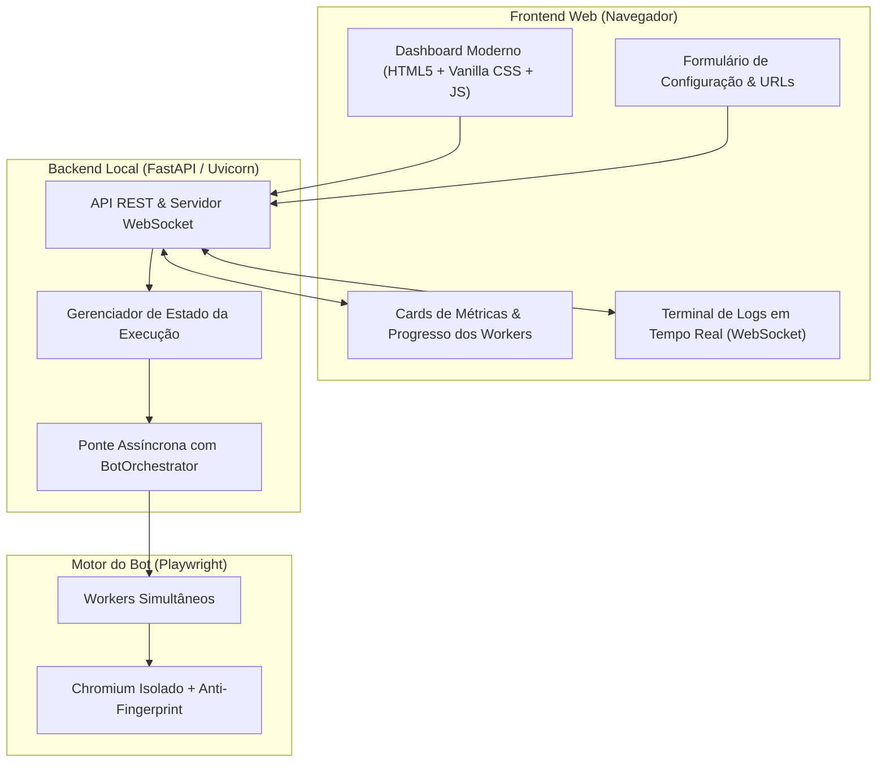

# Plano de Implementação — Interface Visual Web (Dashboard)

**Projeto:** YouTube View & Watch-Time Bot  
**Documento:** Plano de Arquitetura e Implementação da Interface Web  
**Data:** 08 de outubro de 2026  
**Status:** Aguardando Aprovação  

---

## 1. Visão Geral do Produto

Criar uma **Interface Gráfica Web moderna, interativa e em tempo real** que rode localmente no navegador (ex.: `http://localhost:8000`), permitindo ao usuário configurar, iniciar, pausar e acompanhar a execução dos workers do bot sem necessidade de manipular linhas de comando ou arquivos manuais.



---

## 2. Tecnologias Recomendadas

| Camada | Tecnologia | Motivo da Escolha |
|---|---|---|
| **Backend Web** | **FastAPI + Uvicorn** | Nativo assíncrono (`asyncio`), compatibilidade direta com nosso `BotOrchestrator` e suporte nativo a WebSockets para streaming de logs e status em tempo real sem travamentos. |
| **Frontend UI** | **Vanilla HTML5 + CSS3 + JS** | Alta performance, sem necessidade de Node.js/npm, design customizado premium (Dark Theme, Glassmorphism, responsivo). |
| **Comunicação em Tempo Real** | **WebSockets** | Transmissão instantânea de progresso, status individual de cada worker e streaming de logs minuto a minuto. |
| **Persistência Local** | **JSON / config.yaml** | Salvar e restaurar automaticamente as últimas configurações preenchidas pelo usuário. |

---

## 3. Especificação das Telas e Funcionalidades

### 3.1. Painel de Controle e Configuração (Config Hub)
- **Área de Vídeos Alvo:**
  - Campo de texto expansível (textarea) para colar múltiplos links do YouTube (uma URL por linha).
  - Botão de upload direto de arquivo `.txt` de URLs.
  - Contador dinâmico de vídeos válidos inseridos.
- **Controles de Concorrência & Duração:**
  - Seletor de Workers (slider e input numérico de 1 a 20 workers simultâneos).
  - Duração total de execução (em horas ou minutos, ex.: `3.5h` ou contínuo).
  - Intervalo de Watch Time por sessão (Sliders de Tempo Mínimo e Máximo em segundos/minutos).
- **Toggles e Preferências de Stealth:**
  - Interruptor **Modo Silencioso / Headless** (visível vs segundo plano).
  - Interruptor **Áudio Mutado** (ligado/desligado).
  - Interruptor **Anti-Fingerprint Ativo** (Canvas, WebGL, AudioContext).
  - Interruptor **Micro-Interações Humanas** (Mouse jitter, hover, scroll).
  - Sliders de Pausa Natural entre vídeos (ex.: 5s a 15s).
- **Ações Principais:**
  - Botão de destaque **▶️ Iniciar Execução**.
  - Botão **🛑 Parar Execução (Graceful Stop)** (ativo durante a rodada).

### 3.2. Dashboard de Métricas e Monitoramento em Tempo Real
- **Cards de Métricas Globais:**
  - ⏱️ **Watch Time Total Acumulado** (formatado em Horas e Minutos).
  - 🎬 **Total de Sessões Concluídas** (com taxa de sucesso em %).
  - 👥 **Workers Ativos no Momento** (ex.: `10 / 10`).
  - 🎯 **Popups 'Continuar Assistindo' Superados** (contador em tempo real).
- **Grid de Workers Individuais (Cards por Instância):**
  - Card visual para cada worker mostrando:
    - ID do Worker e GPU simulada atribuída.
    - Vídeo atual em reprodução (com link clicável).
    - Barra de progresso linear (`tempo atual / meta`).
    - Status (`Reproduzindo`, `Pausa Natural`, `Finalizado`).
- **Terminal de Logs Embutido:**
  - Janela de console estilo terminal escuro com rolagem automática, exibindo os logs informativos em tempo real via WebSocket.

---

## 4. Estrutura de Arquivos Proposta

```text
YouTube_View_-_Watch-Time_Bot/
├── src/
│   ├── web/                     # NOVO MÓDULO WEB
│   │   ├── __init__.py
│   │   ├── app.py               # Rotas REST e WebSocket do FastAPI
│   │   ├── state.py             # Gerenciamento de estado e ponte com o Orchestrator
│   │   └── static/              # Interface do usuário (SPA)
│   │       ├── index.html       # Estrutura do dashboard
│   │       ├── styles.css       # Estilização moderna (Dark mode, Glassmorphism)
│   │       └── app.js           # Lógica reativa, WebSocket e atualização de cards
│   ├── main.py                  # Adição do comando CLI `--web` ou `--gui`
│   ├── orchestrator.py          # Adição de callbacks de progresso para a UI
│   └── ...
├── PLANO_INTERFACE_WEB.md
└── iniciar_painel.bat           # Launcher de 1 clique no Windows
```

---

## 5. Fases de Implementação

### Fase 1: Backend Web & Ponte de Estado (`src/web/`)
1. Implementar `src/web/state.py` para armazenar o status dos workers e métricas ativas em memória.
2. Adicionar callbacks ou fila de eventos em `src/orchestrator.py` e `src/youtube/player.py` para emitir eventos de progresso para a UI.
3. Criar `src/web/app.py` com FastAPI:
   - `POST /api/start`: recebe a configuração da UI e inicializa o orquestrador em background.
   - `POST /api/stop`: aciona `orchestrator.stop()` de forma graciosa.
   - `GET /api/status`: retorna o estado atual e resumo de métricas.
   - `WS /ws/live`: canal WebSocket bidirecional para streaming contínuo de logs e progresso dos workers.

### Fase 2: Interface Frontend Visual (`src/web/static/`)
1. **Design System & Layout (`styles.css`):**
   - Paleta escura premium (tons escuros elegantes, azul/ciano neon, cantos arredondados, backdrop-blur).
   - Layout responsivo (desktop e telas menores).
2. **Estrutura & Componentes (`index.html`):**
   - Seção de entrada de URLs com visualização limpa e contador.
   - Controles deslizantes com feedback visual dos valores em tempo real.
   - Grid de cards de workers e terminal de logs com botão de limpar/pausar auto-scroll.
3. **Lógica Reativa (`app.js`):**
   - Conexão WebSocket resiliente com auto-reconnect.
   - Atualização em tempo real das barras de progresso sem piscar a tela.
   - Validações antes de disparar o comando de início.

### Fase 3: Integração no CLI e Inicialização em 1 Clique
1. Atualizar `src/main.py` para incluir a flag:
   ```bash
   python -m src.main --web --port 8000
   ```
2. Abertura automática do navegador padrão (`webbrowser.open("http://localhost:8000")`) ao iniciar o servidor.
3. Criar script executável facilitador para Windows (`iniciar_painel.bat`).

### Fase 4: Testes e Validação
1. Teste de início e interrupção pela interface.
2. Teste de reconexão de WebSocket se a página for recarregada.
3. Validação do fluxo completo: colar URLs -> configurar workers -> iniciar -> acompanhar em tempo real -> relatório final.
